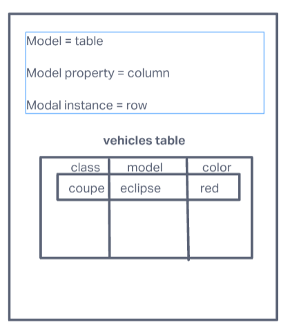

# Data Modeling

## NoSql vs SQL

- SQL vs. NoSQL
- [Difference Table](/img/SQL-NoSQL.png)
- [SQL vs NoSQL Database Differences Explained with few Example DB](https://www.thegeekstuff.com/2014/01/sql-vs-nosql-db/?utm_source=tuicool)
- What kind of data is a good fit for an SQL database?
  - high transaction data, or apps that will have a heavy flow of transactions. This is because it is more stable.
- Give a real world example.
  - high transactional applications
- What kind of data is a good fit a NoSQL database?
  - hierarchical data, or large data sets like JSON data.
- Give a real world example.
  - an app needing to store a large amount of data on the desired topic.
- Which type of database is best for hierarchical data storage?
  - NoSql
- Which type of database is best for scalability?
  - NoSQL because instead of increasing the CPU, RAM, or SSD, you just need t increase the servers.

## MySQL vs MongoDB

- What does SQL stand for?
  - Structured Query Language
- What is a relational database?
  - Relational databases have multiple tables that can have data that is connected in some way or another.
  - If you have a table of products and a table of users, you could also have a table of orders that takes in the user id and product id together.
- What type of structure does a relational database work with?
  - Tables
- What is a ‘schema’?
  - A schema is basically the format that is set for the data in the table
- What is a NoSQL database?
  - NoSQL uses collections and documents instead of tables and have the capability to take in a lot more data in JSON files.
  - They also have no schema.
- How does it work?
  - There are no relations. There are collections of data that can be accessed for specific data.
- What is inside of a Mongo database?
  - collections of data
- Which is more flexible - SQL or MongoDB? and why.
  - MongoDB is more flexible because it does not have to follow the strict schema of tables.
- What is the disadvantage of a NoSQL database?
  - Since it is looser, you can get duplicate data and required more work to rework the data.
- [Video](https://www.youtube.com/watch?v=ZS_kXvOeQ5Y)

## Data-Modeling

- Data Model Table Elements
- 
- The table name is Vechicles
  - There are then columns and rows
  - Columns are the **properties** and rows are the **instances**
- Each instance will have a *Primary key*
- Tables can also have a *Foreign key* which is designed to match up to a *primary key*
- **One to Many Relationship**
  - An example would be if one customer was purchasing many products.
- **Many to One Relationship**
  - This would be when there are many employees to one department stores.
  - [Keep it Simple: Easy To Understand Data Modeling Concepts](https://www.essentialsql.com/get-ready-to-learn-sql-7-simplified-data-modeling/)
  