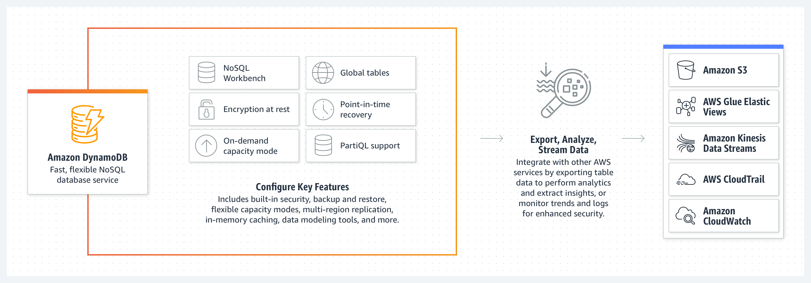

# AWS: API, Dynamo, and Lambda

## API Gateway

- What is **Amazon API Gateway**?
  - It gives Dev's the ability to define *HTTP endpoints* and verbs and have Amazon due the work to ensure handling acl and authentication.
- How does it work?
  - It handles HTTP requests made to API endpoints and routes them to the correct backend API's while also handling authentication.
- It is an essential part of the serverless ecosystem because it allows us to fully utilize AWS ability to allow devs to create a fully functional web app without handling or creating any servers.
- It is works together with some of the following AWS servics:
  - **AWS LAmbda**
    - runs Lambda functions to create HTTP API responses.
  - **AWS SNS**
    - publish SNS notifications when an HTTP API endpoint is accessed.
  - **Amazon Cognito**
    - provide authentication and authorization for your HTTP APIs.
  - [API Gateway](https://www.serverless.com/guides/amazon-api-gateway)
- For a simple HTTP API you would specify the API Gateway endpoint that you want attached to your Serverless function right in the serverless.yml file:

```js
  # serverless.yml 
    functions:
      index:
        handler: handler.hello
        events:
          - http: GET hello # this is the API Gateway event
```

  - [API Gateway](https://www.serverless.com/guides/amazon-api-gateway)

### Benefits of Amazon API Gateway

- Map HTTP requests to specific functions in a SErverless application by using an API Gateway event.
- Map WebSocket events to Serverless functions.
- use multiple microservices to serve the same top-level API.
- Save time with integrations like auth, portal, CloudTrail, CloudWatch, and so on.

### Drawbacks

- Can cause some latency in you API with can add costs.

### [How API Gateway Works (Diagram)](https://aws.amazon.com/api-gateway/)


## AWS DynamoDB

- DynamoDB is a key-value NoSQL database offered by AWS.
- It is a good fit for the following use cases:
  - Apps with large amounts of data and strict latency requirements.
  - Serverless apps using Lambda.
    - Since DynamoDB is accessible using HTTP API and performs authentication and authorization using IAM roles, it makes things smoother
      - [Source](https://www.dynamodbguide.com/what-is-dynamo-db/)
  - It has data sets with simple, known access patterns.

### [DynamoDB Diagram](https://aws.amazon.com/dynamodb/)



## Dynamoose

- Basically, Dynamoose is AWS's Mongoose.
- It is the modeling tool based off of AWS DynamoDB.
