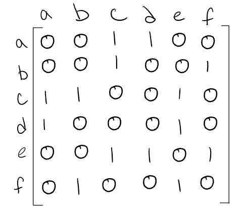

# Graphs

## Terminology

- **Vertex** : this is essentially the equivalent of a node
- **Edge** : connects two nodes
- **Neighbor** : terminology for nodes that are connected to each other by an edge
- **Degree** : this represents how many edges one node has

## Directed vs Undirected

- **Undirected Graphs** have no direction or flow between edges.
- **Directed Graphs** are when edges have directions that point to a node.
- See the example given from [Code Fellows](https://codefellows.github.io/common_curriculum/data_structures_and_algorithms/Code_401/class-35/resources/graphs.html) for a *directed graph*:

## Complete vs Connected vs Disconnected

- **Complete Graphs** occur when all nodes are connected to all other nodes.
- **Connected Graphs** occur when all nodes have at least one edge leading to another node.
- **Disconnected Graphs** occur when there is one or more nodes that have no edges connecting them to another node.

## Acyclic vs Cyclic

- **Acyclic Graphs** is when a directed graph does not have a node that cycles back to itself.
- **Cyclic Graphs** are the opposite

## Graph Representation

- **Adjacency Matrix** is represented by a 2-D array.
- Consider this to be our sample *Undirected Graph* below:

- This would be a sample of an **Adjacency Matrix** for it:

- The most common way to represent graphs is through an **Adjaceny List** like below:

